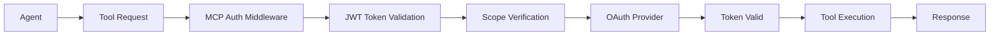

# Authentication Overview - Tools

## Tools Authentication

### Overview

Tools authentication in Kagent leverages the **Model Context Protocol (MCP)** authentication framework. MCP provides a standardized approach for securing tool integrations using OAuth 2.1 and OpenID Connect standards.

**Reference**: [MCP Authentication Documentation](https://mcp-auth.dev/docs)

### MCP Authentication Architecture

MCP authentication follows a **delegated authentication model** where:
- Tools act as **resource servers**
- Authentication is delegated to **compatible OAuth providers**
- **Minimal server-side authentication logic** is required
- **Standards-compliant** OAuth 2.1 and OpenID Connect implementation

### Authentication Methods

#### 1. Bearer Token Authentication
```python
# MCP Auth configuration
mcp_auth = MCPAuth(
    server=fetch_server_config(
        '<auth-server-url>',
        type=AuthServerType.OIDC
    )
)

# Bearer authentication middleware
bearer_auth = mcp_auth.bearer_auth_middleware(
    "jwt", 
    required_scopes=["read", "write"]
)
```

#### 2. JWT Token Validation
- **Standards-compliant JWT validation**
- **Scope-based access control**
- **Metadata endpoint configuration**
- **Provider-delegated token verification**

### Tool Server Authentication Flow



### Integration with Kagent Tools

#### Built-in Tool Server (`go/tools/`)
- **MCP protocol integration**: Uses `github.com/mark3labs/mcp-go` library
- **Bearer token support**: JWT-based authentication for tool requests
- **Scope-based authorization**: Different permission levels for tool operations
- **Provider-agnostic**: Compatible with various OAuth providers

#### Current Implementation Status
**Python Backend Authentication** (Production Ready):
- **Location**: `python/src/autogenstudio/web/auth/`
- **JWT Management**: Complete token creation and validation (`manager.py:44-151`)
- **OAuth Providers**: GitHub fully implemented (`providers.py:51-151`), MSAL/Firebase frameworks ready
- **Middleware Protection**: Request filtering and WebSocket authentication (`middleware.py:13-120`)
- **Role-Based Access**: User roles and permission framework (`dependencies.py:46-66`)
- **Configuration**: Environment-based provider selection (`models.py:28-82`)

**Current Gap**: Authentication routes not mounted in main application (`app.py`)

#### Tool Authentication Configuration
```go
// go/tools/ configuration
type ToolServerConfig struct {
    Auth struct {
        Provider     string   `yaml:"provider"`     // OAuth provider
        ServerURL    string   `yaml:"serverUrl"`    // Auth server metadata URL
        RequiredScopes []string `yaml:"scopes"`     // Required OAuth scopes
        JWTValidation struct {
            Issuer   string `yaml:"issuer"`
            Audience string `yaml:"audience"`
        } `yaml:"jwtValidation"`
    } `yaml:"auth"`
}
```

### Security Considerations

#### MCP Security Best Practices
1. **Standards Compliance**: Use OAuth 2.1 and OpenID Connect compliant providers
2. **Minimal Authentication Logic**: Delegate full authentication to the provider
3. **Scope-based Access**: Implement granular permission control
4. **Token Validation**: Verify JWT signatures and required scopes
5. **Metadata Endpoints**: Use provider metadata for configuration

#### Tool-Specific Security
- **Tool isolation**: Each tool server can have independent authentication
- **Principle of least privilege**: Tools request only necessary scopes
- **Audit logging**: Tool access and operations are logged for security
- **Resource protection**: Tools validate user permissions before execution

### Environment Configuration

#### MCP Authentication Variables
```bash
# MCP Auth Server Configuration
MCP_AUTH_SERVER_URL=https://auth.example.com
MCP_AUTH_PROVIDER=oidc

# JWT Configuration
MCP_JWT_ISSUER=https://auth.example.com
MCP_JWT_AUDIENCE=kagent-tools

# Required Scopes
MCP_REQUIRED_SCOPES=tools:read,tools:execute,k8s:read
```

#### Tool Server Configuration
```yaml
# helm/kagent/values.yaml
toolServer:
  auth:
    enabled: true
    provider: "oidc"
    serverUrl: "https://auth.example.com"
    scopes:
      - "tools:read"
      - "tools:execute"
      - "k8s:read"
    jwtValidation:
      issuer: "https://auth.example.com"
      audience: "kagent-tools"
```

### Future Roadmap

- **MCP Specification Evolution**: Transitioning to pure resource server role
- **Enhanced Provider Support**: Additional OAuth provider integrations  
- **Fine-grained Permissions**: Tool-level and operation-level authorization
- **Cross-tool Authentication**: Shared authentication context across tool servers

