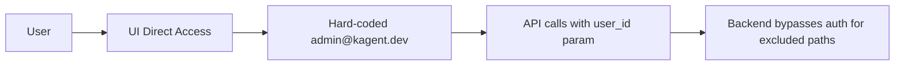
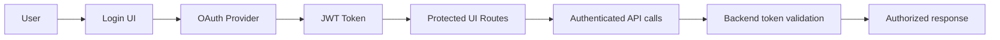

# Authentication Overview - UI

## UI Authentication architecture

### Overview

The UI authentication flow can be configured with several auth strategies, including:

- Anonymous users can access the UI.
- Basic authentication user/password.
- Token based authentication to use Kubernetes service accounts.
- OIDC (OpenID Connect) authentication.

!!! Important: when UI accessed with kubectl port forward token based authentication is used by default, so no need to configure it. ??

## UI Authentication & Authorization Details

### Current Implementation Status

The UI authentication is currently in **development/demo mode** with minimal security implementation:

#### Frontend (Next.js UI) - Development Mode Only
- **Hard-coded user**: Uses `admin@kagent.dev` as default user (`ui/src/lib/userStore.ts:4-5`)
- **No login/logout UI**: No authentication forms or session management components
- **No route protection**: All routes are publicly accessible
- **No token handling**: API calls use query parameter user identification instead of Authorization headers (`ui/src/app/actions/utils.ts:24`)
- **Local storage only**: User state stored in Zustand store with localStorage persistence (`ui/src/lib/userStore.ts:1-25`)

#### Backend (Python FastAPI) - Production Ready
- **Location**: `python/src/autogenstudio/web/auth/`
- **Comprehensive auth framework**: Complete authentication system ready for production
- **JWT-based authentication**: Token creation, validation, and expiry management (`manager.py:44-151`)
- **Multiple auth providers**: GitHub OAuth fully implemented (`providers.py:51-151`), MSAL/Firebase frameworks ready
- **WebSocket authentication**: Support for real-time connection auth (`middleware.py:78-120`)
- **Middleware-based protection**: Request filtering and authorization enforcement (`middleware.py:13-76`)
- **Role-based access control**: User roles and permission framework (`dependencies.py:46-66`)

#### Integration Gap
- **Auth routes not mounted**: Backend authentication routes imported but not integrated in main API (`app.py`)
- **Frontend-backend disconnect**: UI bypasses authentication entirely while backend has comprehensive security

### Supported Authentication Strategies

#### 1. Anonymous Access (Current Default)
```typescript
// ui/src/lib/userStore.ts
const defaultUser = { userId: "admin@kagent.dev" }
```

#### 2. OAuth Providers (Backend Ready)
- **GitHub OAuth**: Complete implementation with client/secret configuration
- **Microsoft MSAL**: Framework ready, needs configuration
- **Firebase Auth**: Framework ready, needs configuration

#### 3. Token-Based Authentication
- **JWT tokens**: Backend creates and validates tokens with configurable expiry
- **Bearer authentication**: API endpoints support Authorization header validation
- **Service account tokens**: Kubernetes token integration (planned)

### Authorization Architecture

#### Current State
- **No RBAC implementation**: All users have identical permissions
- **No route guards**: Frontend has no protected routes
- **No feature flags**: All UI components visible to all users
- **Hard-coded permissions**: Backend user model includes roles but unused

#### Planned Authorization
- **Role-based access control**: Admin, User, ReadOnly roles
- **Feature-based permissions**: Agent creation, team management, tool access
- **Resource-level authorization**: User-specific agent and team visibility
- **Kubernetes RBAC integration**: Service account permission mapping

### API Authentication Integration

#### Current API Pattern
```typescript
// All API calls append hard-coded user
const response = fetch(`/api/agents?user_id=admin@kagent.dev`)
```

#### Production API Pattern
```typescript
// Token-based authentication
const response = fetch('/api/agents', {
  headers: {
    'Authorization': `Bearer ${jwt_token}`,
    'Content-Type': 'application/json'
  }
})
```

### Authentication Flow Details

#### Development Flow (Current)


#### Production Flow (Target)


### Session Management

#### Frontend Session (Current)
- **Storage**: Zustand store with localStorage persistence
- **Duration**: Indefinite (no expiration)
- **Security**: No token encryption or secure storage
- **State**: Only stores userId string

#### Backend Session (Available)
- **JWT tokens**: Configurable expiry (default 60 minutes)
- **Token validation**: Signature and expiry checking
- **WebSocket sessions**: Real-time connection authentication
- **Refresh tokens**: Framework ready for implementation

### Security Considerations

#### Current Security Gaps
1. **No authentication barriers**: UI completely bypasses security
2. **Hard-coded credentials**: Development-only user configuration (`ui/src/lib/userStore.ts:4-5`)
3. **No session expiry**: Users never logged out automatically
4. **Client-side only auth**: No server-side session validation
5. **No audit logging**: User actions not tracked for security
6. **API parameter-based auth**: Uses `user_id` query parameter instead of Authorization header (`ui/src/app/actions/utils.ts:24`)
7. **Authentication routes inactive**: Backend auth endpoints not mounted in main API (`python/src/autogenstudio/web/app.py`)

#### Production Security Requirements
1. **OAuth integration**: Proper third-party authentication flow
2. **JWT token management**: Secure token storage and refresh
3. **Route protection**: Authentication guards for sensitive pages
4. **Role-based rendering**: UI components based on user permissions
5. **Session security**: Automatic logout and token expiry handling
6. **CSRF protection**: Cross-site request forgery prevention
7. **Audit logging**: User action tracking and security monitoring

### Environment Configuration

#### Backend Auth Environment Variables
```bash
# Auth provider selection
AUTOGENSTUDIO_AUTH_TYPE=none|github|msal|firebase

# JWT configuration
AUTOGENSTUDIO_JWT_SECRET=your-secret-key
AUTOGENSTUDIO_TOKEN_EXPIRY=3600

# GitHub OAuth
GITHUB_CLIENT_ID=your-github-client-id
GITHUB_CLIENT_SECRET=your-github-client-secret

# Microsoft MSAL
MSAL_CLIENT_ID=your-msal-client-id
MSAL_CLIENT_SECRET=your-msal-client-secret
MSAL_TENANT_ID=your-tenant-id

# Firebase
FIREBASE_PROJECT_ID=your-project-id
FIREBASE_API_KEY=your-api-key
```

#### Frontend Configuration (Missing)
```typescript
// Needed in ui/.env.local
NEXT_PUBLIC_AUTH_PROVIDER=github|msal|firebase
NEXT_PUBLIC_API_BASE_URL=https://api.kagent.dev
NEXT_PUBLIC_OAUTH_REDIRECT_URI=https://ui.kagent.dev/auth/callback
```

